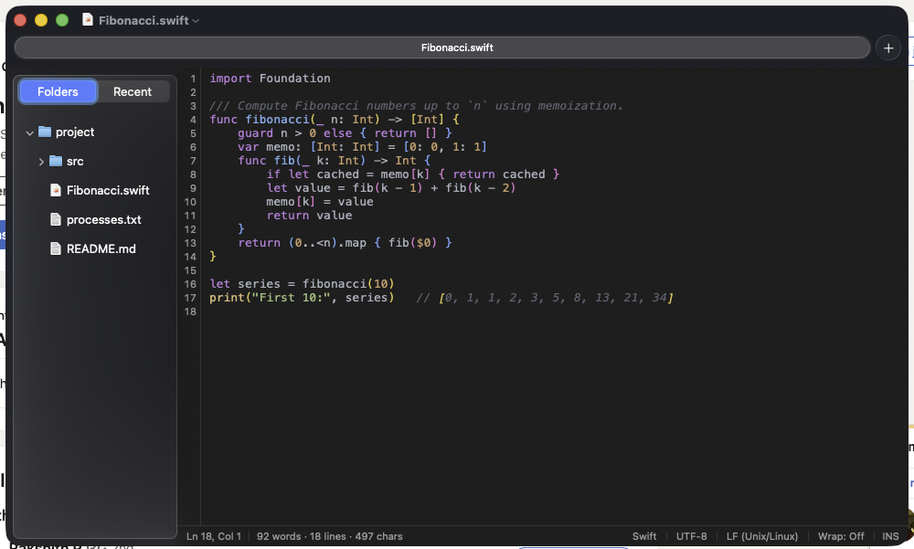
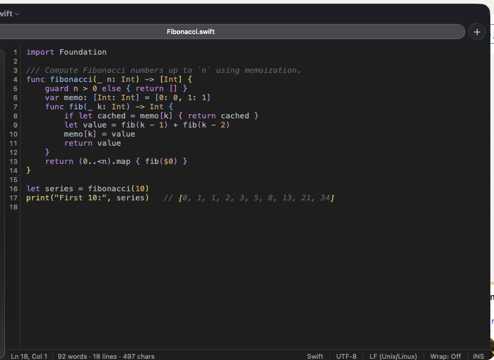
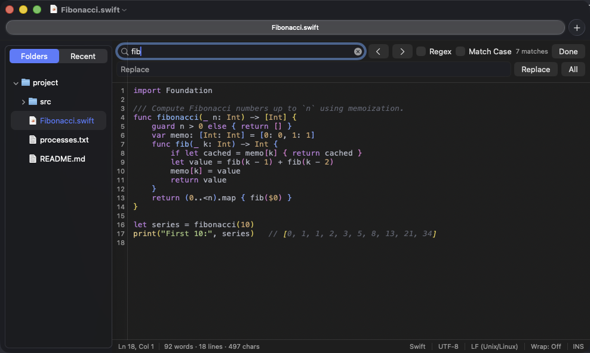
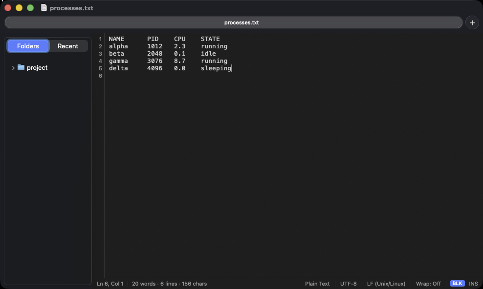
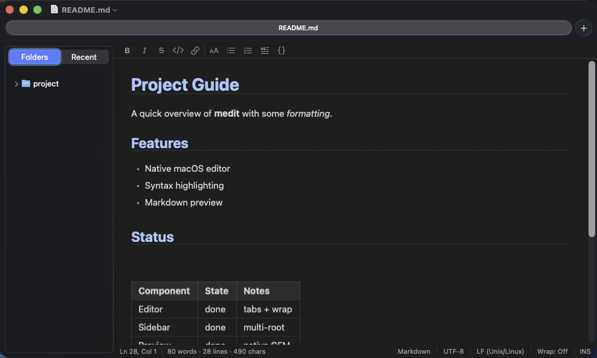
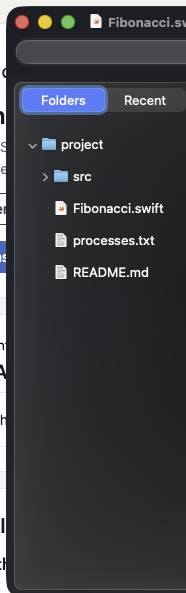

# medit

**A native macOS text editor — a clean-room AppKit reimplementation of the gedit experience.**

medit gives you the simple, no-friction editing of [gedit](https://gedit-technology.github.io/apps/gedit/)
without the GTK baggage on macOS: real Mac menus and keyboard shortcuts, native
file dialogs, native window tabs, a proper app icon, and no 60-package Homebrew
runtime. It's a scratchpad and a code editor that feels like it belongs on the
Mac.


**Status:** working, **v2.8.0**. A native tabbed editor with syntax highlighting,
regex find/replace, find-in-all-tabs, Go to Line, a status bar with live word
count, auto-indent, whitespace hygiene, manual language/encoding control,
reload-on-external-change, PC-style navigation keys, an optional multi-root
sidebar file browser with a Recent Files pane, a **rendered Markdown preview &
native printing**, sort/case text transforms, and **column (block) editing**.

Targets **macOS 14 (Sonoma)** and later. Universal — Apple Silicon and Intel.

<!-- SCREENSHOT: hero — medit open on a code file with the sidebar visible, syntax
     highlighting, line numbers, and the status bar. Place here as docs/images/hero.png -->


---

## Table of contents

- [Features](#features)
- [User Manual](docs/MANUAL.md)
- [Install](#install)
- [Build from source](#build-from-source)
- [Keyboard shortcuts](#keyboard-shortcuts)
- [Architecture](#architecture)
- [App icon](#app-icon)
- [Relationship to gedit](#relationship-to-gedit)
- [Contributing](#contributing)
- [License](#license)
- [Acknowledgements](#acknowledgements)

---

## Features

> A full walkthrough — every feature, setting, and shortcut — is in the
> **[User Manual](docs/MANUAL.md)**. This is the highlights tour.

### Editing core

- **Native window tabs** — macOS tabbing with an always-visible tab bar and **+**
  button. Open a tab via ⌘T, the **File** menu, the **+**, or the editor's
  right-click menu.
- **Syntax highlighting** — 70+ languages via
  [HighlighterSwift](https://github.com/smittytone/HighlighterSwift) (highlight.js),
  auto-detected from the file extension (and shebang lines for extension-less
  scripts). The theme follows the system light/dark appearance automatically.
- **Line numbers** (⇧⌘L) and **word wrap** (toggle in **View**).
- **Auto-indent & bracket assist** — new lines keep the previous indent (and add a
  level after `{` or `:`); typing a bracket auto-closes it. Both toggle in
  **Settings**.
- **Rainbow brackets** — matching brackets colored by nesting depth, with the
  caret's enclosing pair emphasized (bold / underline / background). Toggle in
  **View** / **Settings**.
- **Whitespace hygiene** — strip trailing whitespace + ensure a final newline on
  save, plus **Show Invisibles** to render spaces/tabs/line breaks as faint marks.
- **PC-style navigation keys** — Home/End move to the start/end of the line (Ctrl
  for the whole document, Shift to extend); **Insert** toggles overwrite mode with
  a block caret (Shift+Insert pastes, Ctrl+Insert copies). Toggle off in
  **Settings** for macOS-native Home/End.

<!-- SCREENSHOT: editor close-up showing syntax highlighting, line-number gutter,
     and rainbow brackets. → docs/images/editor.png -->


### Find, replace & navigate

- **Find & Replace** — a custom in-editor bar (⌘F / ⌥⌘F) with **regex** and
  **match-case** toggles, a live match count, and `$1` capture-group replacement.
  (Apple's built-in find bar can't expose regex in its UI; this one can.)
- **Find in All Tabs** (⇧⌘F) — search across every open document at once, with
  regex; click a result to jump straight to it.
- **Go to Line** (⌘L or ⌃G).

<!-- SCREENSHOT: the Find & Replace bar open with the Regex + Match Case toggles
     and a match count. → docs/images/find-replace.png -->


### Text transforms & block editing

- **Sort Lines** (ascending / descending) and **Change Case** (Upper / Lower /
  Capitalize) on the selected lines — **Edit ▸ Text**.
- **Column (block) editing** — hold **⌥ and drag** a vertical rectangle, or toggle
  **Column Selection Mode** (⌥⌘B), then type onto every row at once (or replace the
  rectangle), delete across rows, and copy/cut/paste as a block. Great for scraping
  aligned terminal output. A **BLK** pill in the status bar shows when it's active.

<!-- SCREENSHOT: a rectangular block selection spanning several rows of aligned
     text, with the blue BLK pill in the status bar. → docs/images/block-edit.png -->


### Markdown

- **Rendered preview** (⇧⌘V) — full GitHub-Flavored Markdown rendered in a
  WKWebView (HTML + CSS). **Auto-show for `.md`** (on by default) and
  **auto-refresh** are toggles in **Settings**.
- **Formatting toolbar** — for Markdown files, a toolbar of one-click Bold / Italic
  / Strikethrough / Code / Link / Heading / lists / Quote / Code-block that
  wrap or prefix your selection (each toggles off on a second click). Toggle in
  **View** / **Settings**.
- **Printing** — ⌘P prints Markdown documents through a **separate, natively-drawn**
  path (custom code panels, bordered tables, heading rules) independent of the
  on-screen web-view preview; plain text and source files print as monospace with
  optional line numbers and a filename header.

<!-- SCREENSHOT: a Markdown file side-by-side: source on the left, rendered preview
     on the right (or the preview alone), showing a table + code block.
     → docs/images/markdown-preview.png -->


### Files, sidebar & sessions

- **Sidebar file browser** (optional, off by default — ⌘⌃0) — a multi-root file
  tree: **Open Folder…** (⇧⌘O) to add roots, navigate, and manage files (New
  File/Folder, Rename, Move to Trash, Reveal in Finder, drag-to-move). Toggles for
  folders-first sort, sort direction, single-click open, sidebar side, confirm
  before delete, show hidden files, reveal the active file. Zero overhead when
  hidden.
- **Recent Files pane** — the sidebar switches between **Folders** and **Recent**
  (the files you've opened/saved, newest first) via a segmented control at its top
  or **View ▸ Show Recent Files in Sidebar**.
- **Session restore** — medit reopens the files you had open when you last quit
  (toggle in **Settings**).
- **Reopen at last size/position** — windows come back where you left them, not at
  the lower-left.
- **Drag & drop to open** — drag one file or several from Finder onto the editor;
  each opens in a tab.

<!-- SCREENSHOT: the sidebar showing the Folders | Recent segmented switcher and a
     file tree, next to the editor. → docs/images/sidebar.png -->


### Status bar & document info

- **Status bar** — live **Ln/Col**, a **word / line / character count** (with a
  selection count when text is selected), language, encoding, line ending, wrap
  state, and the **INS/OVR** + **BLK** mode pills. Toggle the bar and the word
  count independently in **View** / **Settings**.
- **Manual language selection** — click the language in the status bar to override
  syntax highlighting; "Auto-Detect" returns control.
- **Encoding & line endings** — click the encoding to **Reinterpret** (re-decode
  the bytes) or **Convert** (re-encode on save); choose LF or CRLF.

<!-- SCREENSHOT: the status bar in detail, annotated, showing word count + the
     INS / BLK pills. → docs/images/status-bar.png -->


### File handling & robustness

- **Faithful file handling** — encoding detection on open (UTF-8, UTF-16/32 with
  BOM, ISO Latin-1 fallback) with faithful round-trip on save; unsaved-changes
  prompts. Runs sandboxed with user-selected file access.
- **Reload on external change** — medit notices when an open file changes on disk
  and offers to reload (a banner by default; Prompt / Auto-reload-if-clean in
  **Settings**). A deleted file keeps your buffer so you can re-save it.
- **Preferences** (⌘,) — font, appearance (System / Light / Dark), light/dark
  syntax themes, word wrap, line numbers, tab width, spaces-vs-tabs, auto-indent,
  auto-close brackets, strip-on-save, rainbow brackets, Markdown preview/toolbar
  options, print line numbers, word count, session restore, the full set of sidebar
  toggles, smart-substitution options, and PC-keys.

## Install

medit isn't notarized or distributed through the App Store — build it yourself
(it's a couple of commands; see below), or if a release `.app` is attached to a
[GitHub release](../../releases), download it and drag it to `/Applications`.

Because a self-built app is **ad-hoc signed** (not signed with an Apple Developer
ID), the first launch is gated by Gatekeeper. To open it:

1. Right-click `medit.app` → **Open**, then confirm — or
2. Run once from the terminal: `xattr -dr com.apple.quarantine /Applications/medit.app`

After the first open it launches normally and appears in Launchpad and Spotlight.

## Build from source

medit is a local Swift package (`MeditKit` — all the app logic, fully testable)
plus a thin Xcode app target that wraps it in a `.app` bundle. Two external
dependencies, resolved automatically by Swift Package Manager:
[HighlighterSwift](https://github.com/smittytone/HighlighterSwift) for syntax
highlighting, and Apple's [swift-markdown](https://github.com/apple/swift-markdown)
for CommonMark + GFM parsing.

### Run the app (Xcode)

```sh
open App/medit.xcodeproj
```

Press **Run** (⌘R). Xcode resolves both dependencies on the first build.

### Build & test the library (command line)

```sh
swift build
swift test          # 397 tests: pure logic + headless editor smoke tests
```

### Build the app bundle without opening Xcode

```sh
cd App
xcodebuild -project medit.xcodeproj -scheme medit -configuration Release \
  build CODE_SIGNING_ALLOWED=NO
```

The built `medit.app` lands in the Xcode DerivedData `Release` products folder.
To install it, copy it to `/Applications`, ad-hoc sign, and de-quarantine:

```sh
cp -R "$(xcodebuild -project medit.xcodeproj -scheme medit -configuration Release \
  -showBuildSettings 2>/dev/null | awk '/BUILT_PRODUCTS_DIR/{print $3}')/medit.app" /Applications/
codesign --force --deep --sign - /Applications/medit.app
xattr -dr com.apple.quarantine /Applications/medit.app
```

## Keyboard shortcuts

| Shortcut | Action |
|----------|--------|
| ⌘N | New window |
| ⌘T | New tab (a new untitled document) |
| ⌘O | Open… |
| ⌘S / ⇧⌘S | Save / Save As… |
| ⌘W | Close |
| ⌘F | Find (with regex) |
| ⌥⌘F | Find & Replace |
| ⌘G / ⇧⌘G | Find next / previous |
| ⌘J | Jump to selection |
| ⇧⌘F | Find in all tabs |
| ⌘L / ⌃G | Go to Line |
| ⌘P | Print (rendered for Markdown) |
| ⇧⌘V | Show Markdown preview |
| ⌥⌘B | Column (block) selection mode |
| ⌘⌃0 | Toggle sidebar |
| ⇧⌘O | Open Folder… |
| ⇧⌘L | Toggle line numbers |
| Esc | Exit column (block) mode |
| Home / End | Line start / end |
| Shift+Home / Shift+End | Extend selection to line start / end |
| Ctrl+Home / Ctrl+End | Document start / end |
| Insert | Toggle overwrite mode |
| Shift+Insert / Ctrl+Insert | Paste / Copy |
| ⌃⌘F | Enter full screen |
| ⌘, | Settings |

> **Note on the Insert key:** Mac keyboards label the Insert-position key as
> **Help**, and the OS reports it that way (hardware keyCode 114). medit detects
> it by keyCode, so a PC keyboard's Insert key works as expected.

## Architecture

```
medit/
├── Package.swift              Local SwiftPM package + HighlighterSwift + swift-markdown
├── Sources/MeditKit/          All app logic (the testable library)
│   ├── App lifecycle          AppDelegate, MainMenu, LaunchReset
│   ├── Documents / windows    TextDocument (NSDocument), EditorWindowController,
│   │                          EditorViewController, EditorTextView
│   ├── Editor pieces          LineNumberRulerView, SyntaxHighlightingController,
│   │                          FindReplaceBar, StatusBarView, GoToLineSheet,
│   │                          InvisiblesLayoutManager, EditorColors, CBBColors,
│   │                          BracketColorizer, BracketDepthScanner, AXIdentifierCell,
│   │                          ColumnSelection, ReloadBanner
│   ├── Markdown                MarkdownEditing, MarkdownStyleBar, MarkdownRenderer,
│   │                          MarkdownHTMLRenderer, MarkdownPreviewLayoutManager,
│   │                          MarkdownTableRenderer, MarkdownPrinter, PreviewHTMLTemplate
│   ├── Sidebar / recent files  SidebarViewController, FileTreeDataSource,
│   │                          DirectoryWatcher, RecentFilesStore, RecentFilesView
│   ├── Sessions                SessionStore, WindowSession
│   ├── Settings                Preferences, PreferencesWindowController
│   ├── Pure logic (tested)    TextEncodingDetector, LanguageMap, TextSearch,
│   │                          KeyboardNavigator, TextLocator, TextPosition,
│   │                          Indenter, BracketMatcher, TextHygiene, TextStatistics,
│   │                          TextTransforms, LanguageCatalog, ShebangDetector,
│   │                          LineEndings, EncodingCatalog, ExternalChangeResolver,
│   │                          FileTreeNode, FileSystemOperations
│   └── Cross-tab search       FindInTabsCoordinator
├── Tests/MeditKitTests/       397 tests (logic + headless editor smoke tests)
├── App/                       Thin Xcode app target
│   ├── medit.xcodeproj        Depends on the local ../  package
│   ├── main.swift             Entry point — boots NSApplication
│   ├── Info.plist             Document types, bundle identity
│   ├── medit.entitlements     App Sandbox + user-selected file access
│   └── Assets.xcassets        App icon
├── Tools/IconGen/             Core Graphics icon generator (iconmaker.swift)
├── uitests/                    AutoPilot GUI test plans (declarative JSON)
└── docs/                       User manual, design specs (docs/specs/) + plans (docs/plans/)
```

The design deliberately keeps the GUI-free logic — encoding detection, language
mapping, search/replace, key navigation, preferences — in small, independently
testable units, with the AppKit layer built on top. `swift test` exercises both
the pure logic and the editor's view lifecycle **headlessly**, so the whole suite
runs without launching the app.

Two pieces are worth calling out for contributors:

- **`KeyboardNavigator`** is pure value logic (`String` + `NSRange` → `NSRange`)
  with the current line supplied by an injected closure, so all of the Home/End
  selection math is unit-tested without any AppKit.
- **`EditorTextView`** is the only place that touches raw key handling and caret
  drawing. The editor builds its `NSTextView` stack manually (rather than via
  `NSTextView.scrollableTextView()`) specifically so this subclass can be used —
  the assembly intentionally mirrors the factory's TextKit wiring.

## App icon

The icon — a pencil over lined paper in the macOS squircle — is **generated**, not
hand-drawn: `Tools/IconGen/iconmaker.swift` is a self-contained Core Graphics
program that renders the full icon size set and the color variants. Re-render it
with:

```sh
cd Tools/IconGen
swiftc -O -framework AppKit iconmaker.swift -o iconmaker
./iconmaker iconset blue iconset_out      # writes 16…1024 px PNGs
./iconmaker preview previews              # 256 px color variants to compare
```

## Relationship to gedit

medit is **inspired by** gedit but is a **clean-room reimplementation**. No gedit
source code, resources, UI files, or text were read, copied, or ported. Every
Swift file here was written from scratch, and the app icon was generated by the
program in `Tools/IconGen/`. medit reproduces *observable behavior* (tabs, line
numbers, find/replace, an editing scratchpad) and nods to the original's
pencil-and-paper icon *concept* — not its implementation.

Because of that, medit is **not a derivative work of gedit** and is **not bound by
gedit's GPL license**; it is released under the MIT license below. "gedit" is the
name of the GNOME project; medit is an independent project and is not affiliated
with or endorsed by it.

## Contributing

Contributions are welcome. A few ground rules that keep the codebase healthy:

- **Tests first.** The GUI-free logic (in `Sources/MeditKit`) is fully unit-tested;
  new behavior there should come with tests, and the editor's view behavior is
  covered by headless smoke tests in `Tests/MeditKitTests/EditorSmokeTests.swift`.
  Run `swift test` before opening a PR — it must stay green.
- **Keep units small and focused.** Pure logic stays free of AppKit so it can be
  tested headlessly; the AppKit layer sits on top.
- **Match the existing style.** Look at neighboring files (`TextSearch.swift`,
  `Preferences.swift`) for the house patterns.

Design specs live under `docs/specs/` and implementation plans under
`docs/plans/` if you want to see how a feature was reasoned about before it was
built.

## License

medit is released under the **MIT License** — see [LICENSE](LICENSE). You're free
to use, modify, and redistribute it, including commercially, with attribution.

The bundled syntax-highlighting dependency,
[HighlighterSwift](https://github.com/smittytone/HighlighterSwift), is MIT-licensed
and wraps [highlight.js](https://highlightjs.org) (BSD-3-Clause). The bundled
Markdown-parsing dependency, Apple's
[swift-markdown](https://github.com/apple/swift-markdown), is Apache-2.0-licensed.

## Acknowledgements

- [gedit](https://gedit-technology.github.io/apps/gedit/) — the inspiration.
- [HighlighterSwift](https://github.com/smittytone/HighlighterSwift) and
  [highlight.js](https://highlightjs.org) — syntax highlighting.
- [swift-markdown](https://github.com/apple/swift-markdown) — Markdown parsing.
