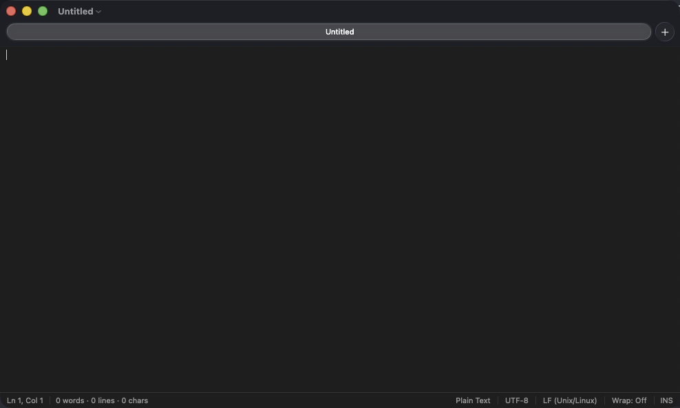
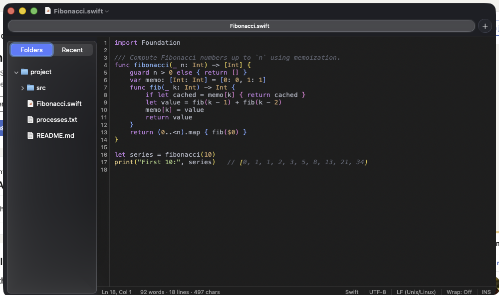
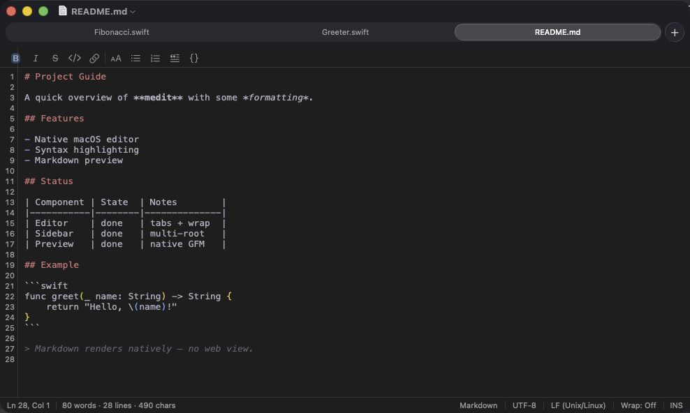
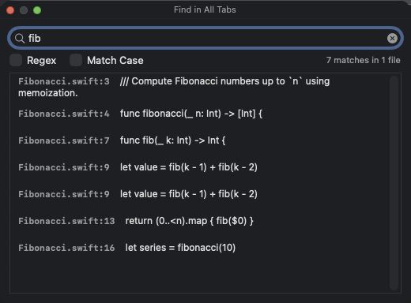
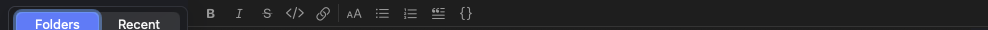
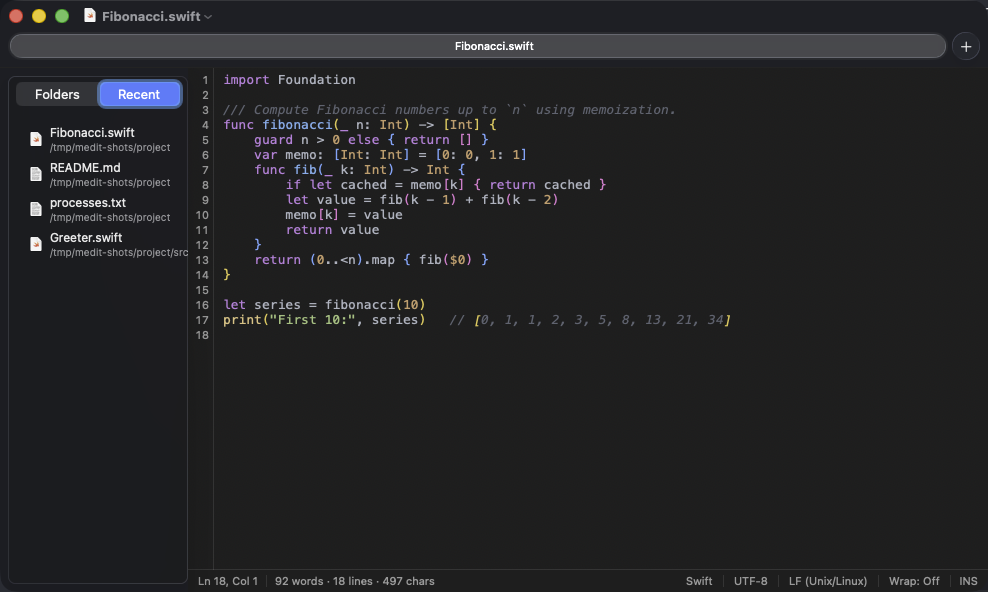
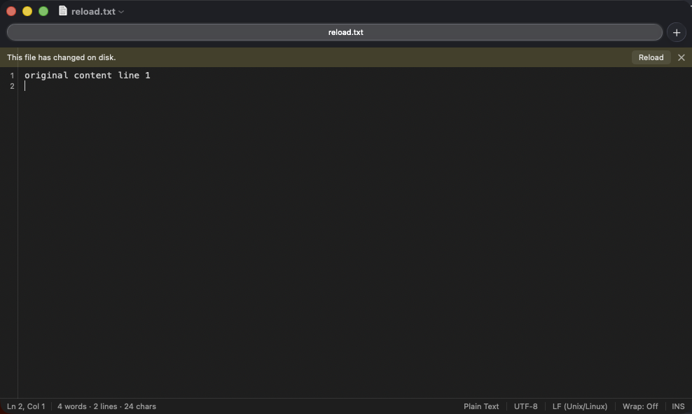
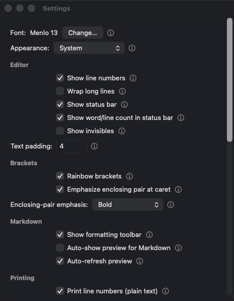

# medit — User Manual

**A native macOS text editor — a clean-room AppKit reimplementation of the gedit
experience.** This manual covers every feature, preference, and keyboard shortcut
in medit **v2.4.1**. For a quick highlights tour, see the [README](../README.md).

> **About the screenshots:** images in this manual are marked with
> `<!-- SCREENSHOT: … -->` placeholders and `` references. They are
> filled in from the running app; if an image is missing, the description in the
> placeholder tells you what it shows.

---

## Table of contents

1. [Getting started](#1-getting-started)
2. [The window at a glance](#2-the-window-at-a-glance)
3. [Working with documents](#3-working-with-documents)
4. [Tabs](#4-tabs)
5. [Editing](#5-editing)
6. [Find & Replace](#6-find--replace)
7. [Syntax highlighting & languages](#7-syntax-highlighting--languages)
8. [Text transforms (sort & change case)](#8-text-transforms-sort--change-case)
9. [Column (block) editing](#9-column-block-editing)
10. [Markdown](#10-markdown)
11. [The sidebar file browser](#11-the-sidebar-file-browser)
12. [Recent files](#12-recent-files)
13. [The status bar](#13-the-status-bar)
14. [Encodings & line endings](#14-encodings--line-endings)
15. [Reload on external change](#15-reload-on-external-change)
16. [Printing](#16-printing)
17. [Sessions & window restoration](#17-sessions--window-restoration)
18. [Settings reference](#18-settings-reference)
19. [Keyboard shortcuts reference](#19-keyboard-shortcuts-reference)
20. [Tips & troubleshooting](#20-tips--troubleshooting)

---

## 1. Getting started

medit targets **macOS 14 (Sonoma) and later** and is **universal** (Apple Silicon
and Intel).

### Installing

Download `medit.app` from a [GitHub release](../../releases) and drag it to
`/Applications`, or build it yourself (see the README's *Build from source*).

Because released builds are **ad-hoc signed** (not signed with an Apple Developer
ID), the first launch is gated by Gatekeeper:

1. Right-click `medit.app` → **Open**, then confirm — or
2. Run once in Terminal: `xattr -dr com.apple.quarantine /Applications/medit.app`

After the first open it launches normally and appears in Launchpad and Spotlight.

### First launch

medit opens with a single empty **Untitled** document (or, if **Reopen last
session** is on — it is by default — the files you had open when you last quit).

<!-- SCREENSHOT: a fresh medit window, empty Untitled document, tab bar with the +
     button, status bar at the bottom. → images/first-launch.png -->

---

## 2. The window at a glance

A medit window has, from top to bottom:

- **The tab bar** — one tab per open document, with a **+** button to add a tab.
- **The optional Markdown toolbar** — appears above the editor for Markdown files
  when enabled.
- **The editor** — your text, with an optional line-number gutter on the left.
- **The optional sidebar** — a file browser on the left (or right), toggled with
  ⌘⌃0.
- **The status bar** — document info along the bottom.

<!-- SCREENSHOT: a labeled/annotated window showing tab bar, sidebar, editor,
     gutter, and status bar. → images/window-anatomy.png -->

---

## 3. Working with documents

| Action | How |
|--------|-----|
| New document | **File ▸ New** (⌘N) |
| New tab | **File ▸ New Tab** (⌘T), the **+** button, or the editor's right-click menu |
| Open a file | **File ▸ Open…** (⌘O), or drag a file from Finder onto the editor |
| Open a folder in the sidebar | **File ▸ Open Folder…** (⇧⌘O) |
| Save | **File ▸ Save** (⌘S) |
| Save as a new file | **File ▸ Save As…** (⇧⌘S) |
| Revert to the saved version | **File ▸ Revert to Saved** |
| Close the current tab | **File ▸ Close** (⌘W) |

### Drag and drop to open

Drag **one file or several** from Finder onto the editor area — each opens in its
own tab. (Dragging text, rather than a file, inserts the text as usual.)

### Unsaved changes

Closing a document with unsaved edits prompts you to save, discard, or cancel —
the standard macOS sheet.

---

## 4. Tabs

medit uses **native macOS window tabs**. The tab bar is always visible (even with a
single tab) so the **+** button is always at hand.

- **New tab:** ⌘T, the **+**, **File ▸ New Tab**, or the editor's right-click menu.
- **Switch tabs:** click a tab, or use the standard macOS tab shortcuts (⌃Tab /
  ⇧⌃Tab, and ⌘1…⌘9 where supported).
- **Reorder:** drag tabs.
- **Move a tab to its own window:** drag it out, or use **Window ▸ Move Tab to New
  Window**.
- **Merge windows into tabs:** **Window ▸ Merge All Windows**.

Opening a file while a lone, untouched **Untitled** tab is present replaces that
blank tab instead of leaving it behind.

<!-- SCREENSHOT: a window with several tabs open. → images/tabs.png -->

---

## 5. Editing

### Auto-indent & bracket assist

- **Auto-indent** — pressing Return keeps the previous line's indentation, and adds
  one level after an opener (`{`, `:`).
- **Indent between brackets** — pressing Return with the caret between a pair
  (`{|}`) splits the pair across three lines with the middle line indented.
- **Auto-close brackets** — typing `(`, `[`, or `{` inserts the closing partner;
  typing the closer when it's already there just steps over it. (Brackets only —
  not quotes.)

All three toggle in **Settings** (on by default).

### Tabs vs. spaces

- **Tab width** and **Insert spaces instead of tabs** are in **Settings** (default:
  **2**, spaces on). With spaces on, Tab inserts spaces and the editor indents with
  spaces.

### Rainbow brackets

Matching brackets are colored by nesting depth so pairs are easy to follow, and the
**pair enclosing the caret** is emphasized — choose **bold**, **underline**, or
**background** in **Settings**. Toggle the whole feature in **View ▸ Rainbow
Brackets** or **Settings**.

<!-- SCREENSHOT: nested brackets in code colored by depth, caret pair emphasized.
     → images/rainbow-brackets.png -->

### Show Invisibles

**View ▸ Show Invisibles** renders spaces, tabs, and line breaks as faint marks —
useful for spotting trailing whitespace or mixed indentation.

### Whitespace on save

**Strip trailing whitespace on save** (Settings, on by default) trims trailing
spaces/tabs and ensures the file ends in a single newline.

### PC-style navigation keys

On by default (toggle in **Settings**):

- **Home / End** — start / end of the line.
- **Ctrl+Home / Ctrl+End** — start / end of the document.
- **Shift** with any of the above extends the selection.
- **Insert** — toggle **overwrite ("type-over") mode**, shown as **OVR** in the
  status bar with a block caret. **Shift+Insert** pastes; **Ctrl+Insert** copies.
  You can also **click the INS/OVR pill** in the status bar to toggle the mode. In
  overwrite mode both typing **and pasting** replace the characters under the caret
  (up to the end of the line) instead of pushing them right.

> **Note on the Insert key:** Mac keyboards label the Insert-position key as
> **Help** and the OS reports it that way (keyCode 114). medit detects it by
> keyCode, so a PC keyboard's Insert key works as expected.

Turn PC-keys **off** to restore macOS-native Home/End (scroll to document
top/bottom).

---

## 6. Find & Replace

medit provides its **own** find bar (Apple's built-in bar can't expose regex in its
UI).

- **Find** (⌘F) — opens the find bar. Type to search; the **match count** updates
  live.
- **Find & Replace** (⌥⌘F) — adds the replacement row and a **Replace** / **All**.
- **Find Next / Previous** — ⌘G / ⇧⌘G.
- **Jump to Selection** — scrolls the current selection into view.

Toggles in the bar:

- **Regex** — treat the search term as a regular expression. Replacement supports
  capture-group references (`$1`, `$2`, …).
- **Match Case** — case-sensitive search.

<!-- SCREENSHOT: the find bar with Regex + Match Case toggles, a query, and a match
     count; the replacement row visible. → images/find-replace.png -->

### Find in All Tabs

**Find ▸ Find in All Tabs…** (⇧⌘F) searches **every open document** at once (regex
supported) and lists the matches grouped by document; click a result to jump
straight to it in the right tab.

<!-- SCREENSHOT: the Find-in-All-Tabs results listing matches across documents.
     → images/find-in-tabs.png -->

### Go to Line

**Edit ▸ Go to Line…** (⌘L, or ⌃G) jumps to a line number.

---

## 7. Syntax highlighting & languages

medit highlights **70+ languages** via
[HighlighterSwift](https://github.com/smittytone/HighlighterSwift) (highlight.js).

- **Auto-detection** — the language is chosen from the file extension, and from the
  **shebang** line (e.g. `#!/usr/bin/env python`) for extension-less scripts.
- **Manual override** — click the **language** in the status bar and pick one;
  choose **Auto-Detect** to return control, or **Plain Text** to turn highlighting
  off.
- **Themes** — the syntax theme follows the **system light/dark** appearance. Pick
  the **light** and **dark** themes independently in **Settings**.

<!-- SCREENSHOT: the language popup open from the status bar. → images/language-popup.png -->

---

## 8. Text transforms (sort & change case)

Under **Edit ▸ Text**:

- **Sort Lines Ascending / Descending** — sorts the selected lines (or the whole
  document if nothing is selected). Sorting is locale-aware and natural-number
  friendly, and a trailing newline is preserved.
- **Make Upper Case / Make Lower Case / Capitalize** — transforms the selection;
  with no selection, it acts on the word at the caret.

Each is a single, undoable edit (⌘Z).

<!-- SCREENSHOT: the Edit ▸ Text submenu open. → images/text-menu.png -->

---

## 9. Column (block) editing

Column (rectangular / "block") editing lets you select and edit a **vertical
rectangle** across rows — ideal for pulling columns out of aligned terminal output
or editing many lines at the same column.

### Entering block mode

- **Option-drag** — hold **⌥** and drag a vertical rectangle in the text, **or**
- **Column Selection Mode** — **Edit ▸ Column Selection Mode** (⌥⌘B) for a
  keyboard-driven block at the caret.

When block mode is active, a blue **BLK** pill appears in the status bar (next to
**INS/OVR**). It's empty when block mode is off.

<!-- SCREENSHOT: a rectangular block selection over aligned columns of text, with
     the blue BLK pill in the status bar. → images/block-edit.png -->

### Editing the block

- **Type** — your text is inserted on **every row** at the column (for a
  zero-width block), or **replaces** the rectangle on every row (for a block with
  width).
- **Backspace** — deletes the column / block across every row.
- **Arrow keys** — move the block corner; **Shift** extends it.
- **Copy / Cut** (⌘C / ⌘X) — copies the rectangle (rows joined by newlines); cut
  also deletes it.
- **Paste** (⌘V) — pastes as a block: each clipboard line drops onto a successive
  row at the caret column.
- **Escape** — exits block mode, leaving a normal caret.

> Short rows are space-padded as needed so an insert lands at the requested column.

---

## 10. Markdown

medit renders Markdown **natively** — no embedded web view.

### Rendered preview

- **Show Markdown Preview** (⇧⌘V) — toggles the rendered view for the current
  Markdown document. It supports full **GitHub-Flavored Markdown**, with
  custom-drawn **code-block panels**, **bordered tables**, heading underline rules,
  and blockquote bars. The body uses a proportional font; code uses monospace.
- **Auto-Show Preview for Markdown** (Settings) — open `.md` files straight into
  the preview.
- **Auto-refresh preview** (Settings) — keep the preview current as you edit or as
  the file changes on disk.

<!-- SCREENSHOT: a Markdown document rendered in the preview, showing a table and a
     fenced code block. → images/markdown-preview.png -->

### Formatting toolbar

For Markdown files, **View ▸ Show Markdown Toolbar** (or Settings) shows a toolbar
above the editor with one-click formatting: **Bold, Italic, Strikethrough, Inline
code, Link** (wrap the selection) and **Heading, Bullet list, Numbered list, Quote,
Code block** (prefix the lines). Each button **toggles** — click again to remove
the syntax. The caret lands in the URL slot when you insert a link.

<!-- SCREENSHOT: the Markdown formatting toolbar above the editor. → images/markdown-toolbar.png -->

### Setting medit as the default `.md` app

medit registers as a handler for Markdown files. To make it the default, in Finder:
**Get Info** on a `.md` file → **Open With** → choose medit → **Change All…**.

---

## 11. The sidebar file browser

The sidebar (off by default) is an optional multi-root file tree. It has **zero
overhead when hidden** — no file watchers, no disk reads.

- **Show / hide:** **View ▸ Show Sidebar** (⌘⌃0).
- **Add a root:** **File ▸ Open Folder…** (⇧⌘O). The sidebar can hold multiple
  root folders at once.
- **Open a file:** double-click (or single-click, if you enable single-click open
  in Settings).
- **Manage files** (right-click): **New File**, **New Folder**, **Rename**, **Move
  to Trash**, **Reveal in Finder**. Drag items to move them.

Sidebar options in **Settings**:

- Sort **folders first**; sort **ascending/descending**.
- **Open on single click**.
- Sidebar on the **left or right**.
- **Confirm before delete**.
- **Show hidden files**.
- **Reveal the active file** in the sidebar as you switch tabs.

<!-- SCREENSHOT: the sidebar with a multi-folder tree and the right-click context
     menu. → images/sidebar.png -->

---

## 12. Recent files

The sidebar shows **either Folders or Recent** — never both. Switch with the
segmented control at the top of the sidebar, or **View ▸ Show Recent Files in
Sidebar**.

The **Recent** list is the files you've opened or saved in medit, newest first,
deduplicated, and remembered across launches. Click to open; right-click for
**Open**, **Reveal in Finder**, **Remove from Recent**, and **Clear Recent Files**.
Files that no longer exist are dimmed.

<!-- SCREENSHOT: the sidebar switched to the Recent pane with a list of files.
     → images/recent-files.png -->

---

## 13. The status bar

Along the bottom of the window (toggle in **View ▸ Show Status Bar**):

- **Ln / Col** — the caret's line and column.
- **Word count** — live **words · lines · characters** (and a selection count when
  text is selected). Toggle separately in **View ▸ Show Word Count**.
- **Language** — click to override syntax highlighting (see §7).
- **Encoding** — click to Reinterpret / Convert (see §14).
- **Line ending** — LF / CRLF; click to change.
- **Wrap** — current word-wrap state; click to toggle.
- **Mode pills** — **INS / OVR** (insert vs. overwrite) and **BLK** (shown when
  column/block mode is active).

<!-- SCREENSHOT: the status bar in detail, annotated. → images/status-bar.png -->

---

## 14. Encodings & line endings

- **On open** medit detects the encoding (UTF-8, UTF-16/32 with BOM, ISO Latin-1
  fallback) and round-trips it faithfully on save.
- Click the **encoding** in the status bar to:
  - **Reinterpret as…** — re-decode the existing bytes with a different encoding
    (use when a file opened with the wrong encoding).
  - **Convert to…** — re-encode the text (applied on the next save).
- Click the **line ending** to choose **LF (Unix/Linux)** or **CRLF (Windows)**.

<!-- SCREENSHOT: the encoding menu open from the status bar. → images/encoding-menu.png -->

---

## 15. Reload on external change

When a file open in medit changes on disk, medit notices and responds based on your
**Settings ▸ On external change** choice:

- **Notify** (default) — show a banner offering **Reload** / **Dismiss**.
- **Prompt** — ask each time.
- **Auto-reload if clean** — reload automatically when you have no unsaved edits.

If the file is **deleted** on disk, medit keeps your buffer so you can re-save it.

<!-- SCREENSHOT: the reload banner across the top of the editor. → images/reload-banner.png -->

---

## 16. Printing

**File ▸ Print…** (⌘P):

- **Markdown documents** print the **rendered** document — formatted, paper-friendly.
- **Plain text and source files** print as monospace, optionally with **line
  numbers and a filename header** (toggle **Print line numbers** in Settings).

Use **File ▸ Page Setup…** for paper size and orientation.

---

## 17. Sessions & window restoration

- **Reopen last session** (Settings, on by default) — medit reopens the files you
  had open when you last quit.
- **Window size & position** — medit reopens its window where you left it.

---

## 18. Settings reference

Open **Settings** with ⌘, . Every control has a tooltip; click the **ⓘ** help
button next to a control for a short explanation.

### Editor

| Setting | Default | What it does |
|---------|---------|--------------|
| Show line numbers | On | The line-number gutter. |
| Wrap long lines | Off | Soft-wrap to the window width. |
| Show status bar | On | The bottom info bar. |
| Show word/line count in status bar | On | The live document statistics segment. |
| Show invisibles | Off | Render spaces/tabs/line breaks as faint marks. |
| Editor padding | 4 | Inset between the text and the window edge. |
| Font / size | Menlo 13 | The editor font. |
| Appearance | System | System / Light / Dark. |
| Light theme / Dark theme | atom-one-light / atom-one-dark | Syntax color schemes per appearance. |

### Brackets

| Setting | Default | What it does |
|---------|---------|--------------|
| Rainbow brackets | On | Color brackets by nesting depth. |
| Emphasize enclosing pair at caret | On | Highlight the pair around the caret. |
| Emphasis style | Bold | Bold / Underline / Background. |

### Markdown

| Setting | Default | What it does |
|---------|---------|--------------|
| Show formatting toolbar | On | The Markdown toolbar for `.md` files. |
| Auto-show preview for Markdown | On | Open `.md` files straight into the preview. |
| Auto-refresh preview | On | Keep the preview current while editing. |

### Printing

| Setting | Default | What it does |
|---------|---------|--------------|
| Print line numbers (plain text) | On | Line numbers + filename header for non-Markdown prints. |

### Smart substitutions

| Setting | Default |
|---------|---------|
| Smart quotes | Off |
| Smart dashes | Off |
| Automatic text replacement | Off |
| Correct spelling automatically | Off |
| Smart copy/paste spacing | Off |
| Check spelling while typing | Off |

### Indentation

| Setting | Default | What it does |
|---------|---------|--------------|
| Insert spaces instead of tabs | On | Tab inserts spaces. |
| Tab width | 2 | Spaces per indent level. |
| PC-style Home/End/Insert keys | On | See §5. |
| Auto-indent new lines | On | Keep indent on Return. |
| Indent between brackets on Return | On | Split `{|}` across lines. |
| Auto-close brackets | On | Insert the closing partner. |
| Strip trailing whitespace on save | On | Trim + final newline. |

### Files

| Setting | Default | What it does |
|---------|---------|--------------|
| Reopen last session's files at launch | On | Restore the previous session. |
| On external change | Notify | Notify / Prompt / Auto-reload if clean. |
| Show sidebar | Off | The file browser. |
| Sort folders first | On | Folder ordering in the sidebar. |
| Sort ascending | On | Sidebar sort direction. |
| Open on single click | Off | Single- vs double-click to open. |
| Sidebar on right | Off | Sidebar side. |
| Confirm before delete | On | Ask before Move to Trash. |
| Show hidden files | Off | Dotfiles in the sidebar. |
| Reveal active file in sidebar | On | Track the active tab in the tree. |

<!-- SCREENSHOT: the Settings window, a couple of sections visible with ⓘ help
     buttons. → images/settings.png -->

---

## 19. Keyboard shortcuts reference

| Shortcut | Action |
|----------|--------|
| ⌘N | New document |
| ⌘T | New tab |
| ⌘O | Open… |
| ⇧⌘O | Open Folder… |
| ⌘S / ⇧⌘S | Save / Save As… |
| ⌘W | Close tab |
| ⌘P | Print (rendered for Markdown) |
| ⌘F | Find (with regex) |
| ⌥⌘F | Find & Replace |
| ⌘G / ⇧⌘G | Find next / previous |
| ⇧⌘F | Find in all tabs |
| ⌘L / ⌃G | Go to Line |
| ⇧⌘V | Show Markdown preview |
| ⌥⌘B | Column (block) selection mode |
| Esc | Exit column (block) mode |
| ⌘⌃0 | Toggle sidebar |
| ⇧⌘L | Toggle line numbers |
| ⌘Z / ⇧⌘Z | Undo / Redo |
| Home / End | Line start / end |
| Shift+Home / Shift+End | Extend selection to line start / end |
| Ctrl+Home / Ctrl+End | Document start / end |
| Insert | Toggle overwrite mode |
| Shift+Insert / Ctrl+Insert | Paste / Copy |
| ⌃⌘F | Enter full screen |
| ⌘, | Settings |

---

## 20. Tips & troubleshooting

- **"medit can't be opened because Apple cannot check it for malware."** It's
  ad-hoc signed; right-click ▸ **Open** the first time, or run
  `xattr -dr com.apple.quarantine /Applications/medit.app`.
- **A file opened with the wrong characters.** Click the encoding in the status bar
  → **Reinterpret as…** and pick the correct encoding.
- **The Markdown preview/toolbar items are greyed out.** They're only available for
  documents recognized as Markdown — set the language to **Markdown** from the
  status bar, or open a `.md` file.
- **The sidebar is empty.** Use **File ▸ Open Folder…** (⇧⌘O) to add a root, or
  switch the sidebar to the **Recent** pane.
- **I can't tell if block mode is on.** Look for the blue **BLK** pill in the status
  bar; press **Esc** (or ⌥⌘B) to exit.
- **My window keeps coming back the wrong size.** medit restores the last window
  frame; resize/move it and quit normally to update the remembered position.

---

*medit is open source under the MIT license. See the [README](../README.md) for
build instructions, architecture, and contribution notes.*
